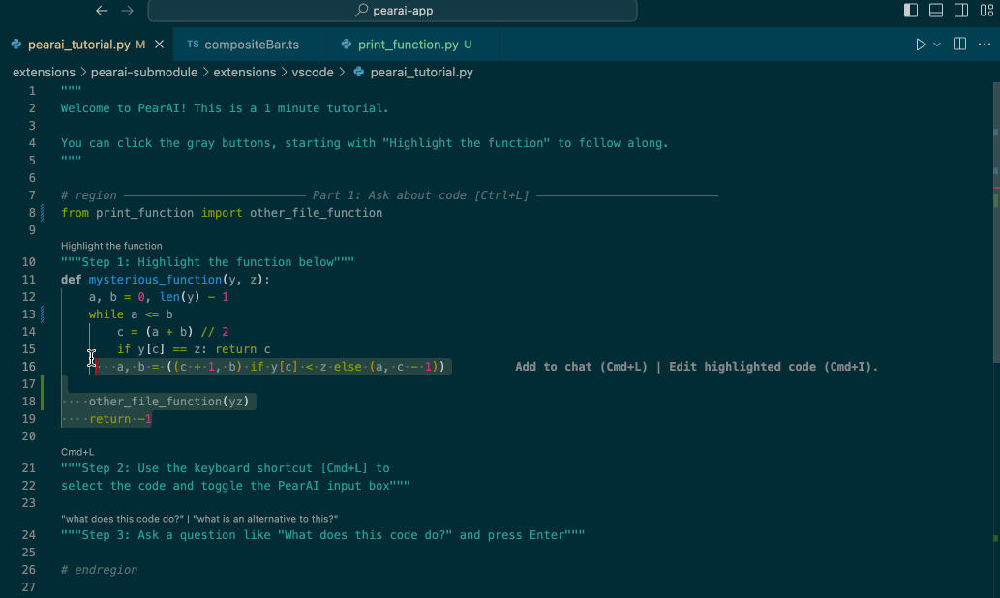
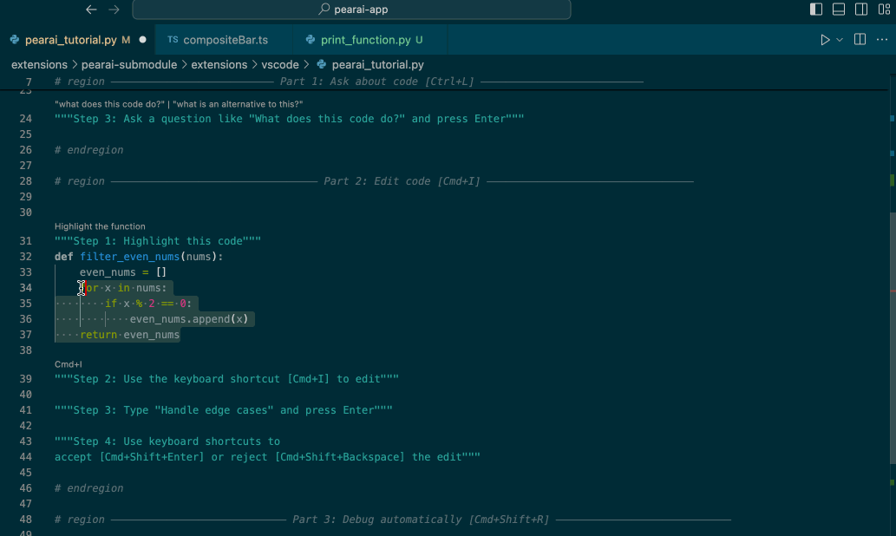
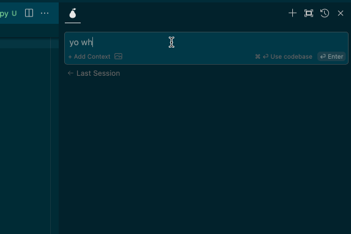

# Nellie IDE Submodule / Extension (Fork of [Continue](https://github.com/continuedev/continue))

This is the source code for the bulk of Nellie IDE's functionality, which is bundled as a VSCode / Nellie IDE extension. It is a fork of [Continue](https://github.com/continuedev/continue).

## Contributing
Go [here](https://github.com/nellie-ai/nellie-ide) for the setup and contributing information.

Got any questions? join the [Nellie IDE Discord](https://discord.gg/7QMraJUsQt)!

## Features 🚀

### Easily understand code sections 🤔

VS Code: `cmd+L` (MacOS) / `ctrl+L` (Windows)

### Refactor functions where you are coding 🛠️

VS Code: `cmd+I` (MacOS) / `ctrl+I` (Windows)

### Ask questions by mentioning a file 📚

<!-- Specific width to match other gifs -->

## License

[Apache 2.0 © 2023 Continue](./LICENSE)

<!-- THOX-DOCS-STANDARD:START -->
## Repository Description

Nellie IDE AI submodule - Multi-provider AI coding assistant (Claude, GPT-4, Ollama)

## Documentation

- [Repository documentation](docs/README.md)
- [Security policy](SECURITY.md)
- [Contributing guide](CONTRIBUTING.md)
- [Legal notice](NOTICE.md)

## THOX.ai LLC

This repository is maintained by THOX.ai LLC.

- Tommy Xaypanya is CTO.
- Craig Ross is CEO.

## Copyright and Legal

Copyright (c) 2026 THOX.ai LLC. All rights reserved unless this repository includes a separate license file that states otherwise.

THOX-specific documentation, configuration, branding, product definitions, and integration work are owned by THOX.ai LLC unless explicitly noted. Third-party dependencies, forks, vendored components, and upstream source materials remain governed by their original licenses and notices.
<!-- THOX-DOCS-STANDARD:END -->
